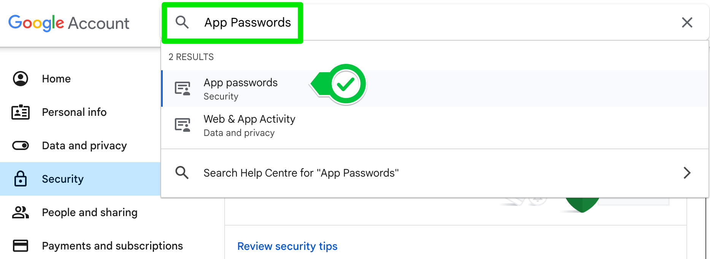

1. Make sure you've got the correct smtp address for your email provider:

Gmail: smtp.gmail.com

Hotmail: smtp.live.com

Outlook: outlook.office365.com

Yahoo: smtp.mail.yahoo.com

If you use another email provider, just Google for your email provider e.g. "Gmail SMTP address"

Below are steps specific to users sending email from Gmail addresses.

2. Go to https://myaccount.google.com/

Select Security on the left and scroll down to How you sign in to Google.

Enable 2-Step Verification

3. Find the section on App Passwords by searching for it:

There you can add an App password.

Select give your app a name e.g., Python Mail and click create. 

COPY THE PASSWORD - This is the only time you will ever see the password. It is 16 characters with no spaces.

Use this App password in your Python code instead of your normal password.

4. By default smtplib.SMTP uses port 25. This used to be the standard SMTP port, but because of abuse in the past most servers nowadays have blocked this port to external traffic. There are still some that do allow it; Hotmail, Live, etc. Port 25 is still used for traffic between servers, but many providers have switched to using port 587 for external traffic. If in doubt, search the internet for "smtp server settings" for your provider.

Add a port number by changing your code to this:

smtplib.SMTP("smtp.gmail.com", port=587)

-----------

Monday Motivation Email Sender
This Python script automatically sends a motivational quote via email every Monday morning. The script reads quotes from a text file and uses the smtplib library to send the selected quote to a specified recipient.

Features
Automated Weekly Emails: Sends an email every Monday with a randomly chosen motivational quote.
Customizable Quotes: Easily add or modify quotes by editing the quotes.txt file.
Secure Email Sending: Uses Gmail's secure SMTP server and 2FA (Two-Factor Authentication) for sending emails.
Prerequisites
Python 3.x installed on your machine.
A Gmail account with 2FA enabled.
A list of motivational quotes stored in quotes.txt (one quote per line).
Installation
Clone the Repository:

bash
Copy code
git clone https://github.com/yourusername/monday-motivation.git
Navigate to the Project Directory:

bash
Copy code
cd monday-motivation
Install Required Packages:

The script uses built-in Python libraries, so no external packages are required.

Setting Up Your Email Account
Enable 2FA (Two-Factor Authentication) on Your Gmail Account:

Go to your Google Account settings and enable 2FA. Follow the on-screen instructions to set it up.

Generate an App Password:

Go to your Google Account settings.
Navigate to "Security" > "App Passwords."
Generate a new app password for "Mail" and copy the generated password. This will be used in the script.
Update the Script:

Replace [Sender Address] with your Gmail address.
Replace [sender's 2FA password] with the app password generated in the previous step.
Replace "reciever@email.com" with the email address of the person you want to send the motivational quote to.
Usage
Edit the quotes.txt File:

Add your motivational quotes in quotes.txt, with each quote on a new line.

Run the Script:

To manually run the script, simply execute it using Python:

bash
Copy code
python send_motivation.py
The script checks if today is Monday and, if so, sends a random quote via email.

Automate the Script:

You can use a task scheduler (like Cron on Linux or Task Scheduler on Windows) to automate the script to run every Monday morning.

Example Cron Job (Linux)
To run the script every Monday at 8 AM, add the following line to your crontab file:

bash
Copy code
0 8 * * 1 /usr/bin/python3 /path/to/send_motivation.py
Troubleshooting
SMTP Authentication Error: Ensure that you have correctly entered your Gmail address and app password in the script.
Quotes Not Sending: Make sure the quotes.txt file exists and contains at least one quote.
Contributing
If you'd like to contribute, please fork the repository and use a feature branch. Pull requests are welcome.

-----

