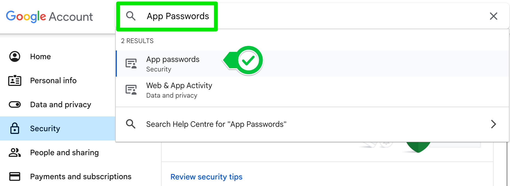

# Automated WhatsApp Birthday Wisher

This Python script automates the process of sending birthday wishes via WhatsApp. The script reads a CSV file containing the names, birthdays, and phone numbers of your contacts and sends a personalized birthday message to those whose birthday is today.

## Features

- Automatically sends birthday wishes to your contacts on WhatsApp.
- Supports international phone numbers with country codes.
- Easy-to-configure CSV input file for storing contact details.

## Requirements

- Python 3.x
- `pywhatkit` library
- `pandas` library

## Installation

1. **Clone the Repository:**

   ```bash
   git clone https://github.com/your-username/birthday-wisher.git
   cd birthday-wisher
   
Create a Virtual Environment (Optional but recommended):


python -m venv venv
source venv/bin/activate  # On Windows: venv\Scripts\activate

Install Required Packages:


pip install -r requirements.txt

Alternatively, install the packages manually:

pip install pywhatkit pandas

Usage->
Prepare Your CSV File:

Create a file named birthdays.csv in the same directory as the script.
The CSV file should have the following columns: Name, Date, Phone.
The Date column should contain the birthday in MM-DD format.
The Phone column should include the phone number with the country code (e.g., +1234567890).


Troubleshooting
Country Code Missing: Ensure that the phone numbers in the CSV file include the correct country code. If not, the script will attempt to add a + sign, but it's better to include the full international number in the correct format.

WhatsApp Web Login: The script uses WhatsApp Web to send messages, so make sure you are logged in to WhatsApp Web on your default browser.

Contributing
Feel free to submit issues or pull requests if you have any suggestions or improvements.

Contact
For any inquiries, contact --> jeetkpa2003@gmail.com.


### Explanation:
- **Doc-strings and Comments:** Added explanations in the code to clarify each step.
- **README File:** Provides a clear guide for setting up, using, and troubleshooting the script. 


--------------------------

# Automated Birthday Wisher

This Python script automates the process of sending personalized birthday emails to your contacts. It reads birthday information from a CSV file and sends a customized email to the contacts whose birthday is today using one of several pre-written letter templates.

## Features

- Automatically sends personalized birthday emails.
- Uses multiple email templates for variety.
- Simple configuration through a CSV file.

## Requirements

- Python 3.x
- `pandas` library

## Installation

1. **Clone the Repository:**

   ```bash
   git clone https://github.com/your-username/birthday-wisher.git
   cd birthday-wisher

Create a Virtual Environment (Optional but recommended):


python -m venv venv
source venv/bin/activate  # On Windows: venv\Scripts\activate

Install Required Packages:


pip install -r requirements.txt

Alternatively, install the package manually:


pip install pandas

Configuration
To run and test the script, you need to update a few placeholders:

Email Credentials:

Replace MY_EMAIL and MY_PASSWORD in the script with your own email address and password.
Allow Less Secure Apps (for Gmail):

If you are using Gmail, ensure that your account allows access from less secure apps. This can be enabled from your Google account settings.
SMTP Server Address:

Replace "YOUR EMAIL PROVIDER SMTP SERVER ADDRESS" with the SMTP server address for your email provider (e.g., "smtp.gmail.com" for Gmail).
Prepare the CSV File:

The script reads birthday information from a CSV file named birthdays.csv in the same directory. This file should have the following columns: name, email, month, and day.

Example:


name,email,month,day
John Doe,johndoe@example.com,8,24
Jane Smith,janesmith@example.com,12,25

Create Letter Templates:

Create a folder named letter_templates in the same directory as the script. Inside this folder, create text files named letter_1.txt, letter_2.txt, and letter_3.txt.
These files should contain a placeholder [NAME] where the recipient's name will be inserted.

Example letter_1.txt:


Dear [NAME],

Wishing you a very Happy Birthday! Hope you have a fantastic day filled with joy and happiness.

Best regards,
[Your Name]

Usage
To run the script:


python main.py

The script will check if today matches any birthday in the CSV file and send a customized email to the matching contacts.

Troubleshooting
Login Issues: If you encounter login issues, make sure your email provider allows access from less secure apps and that you have entered the correct credentials.

SMTP Server Error: Ensure that you have correctly entered the SMTP server address for your email provider.

CSV Format: Make sure the birthdays.csv file is correctly formatted with columns name, email, month, and day.


Contributing
Feel free to submit issues or pull requests if you have any suggestions or improvements.

Contact
For any inquiries, contact your-> jeetkpa2003@gmail.com.


### Explanation:
- **Docstrings and Comments:** Added to clarify the purpose and function of each part of the code.
- **README File:** Provides a clear guide on setting up, configuring, and using the script, including specific steps to customize and run the script effectively.


-------------------------

1. Make sure you've got the correct smtp address for your email provider:

Gmail: smtp.gmail.com

Hotmail: smtp.live.com

Outlook: outlook.office365.com

Yahoo: smtp.mail.yahoo.com

If you use another email provider, just Google for your email provider e.g. "Gmail SMTP address"


Below are steps specific to users sending email from Gmail addresses.

2. Go to https://myaccount.google.com/

Select Security on the left and scroll down to How you sign in to Google.

Enable 2-Step Verification


3. Find the section on App Passwords by searching for it:




There you can add an App password.

Select give your app a name e.g., Python Mail and click create. 


COPY THE PASSWORD - This is the only time you will ever see the password. It is 16 characters with no spaces.

Use this App password in your Python code instead of your normal password.


4. By default smtplib.SMTP uses port 25. This used to be the standard SMTP port, but because of abuse in the past most servers nowadays have blocked this port to external traffic. There are still some that do allow it; Hotmail, Live, etc. Port 25 is still used for traffic between servers, but many providers have switched to using port 587 for external traffic. If in doubt, search the internet for "smtp server settings" for your provider.

Add a port number by changing your code to this:

smtplib.SMTP("smtp.gmail.com", port=587)


-----------
